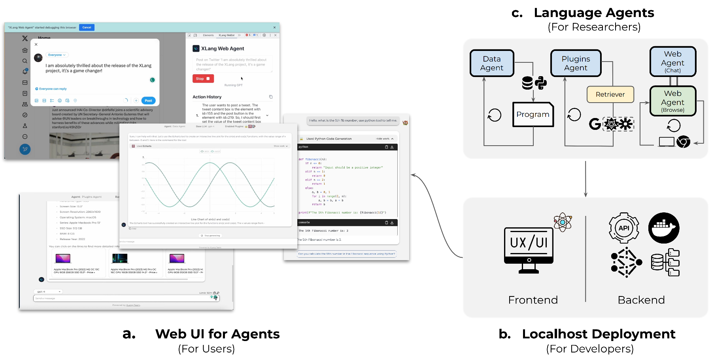
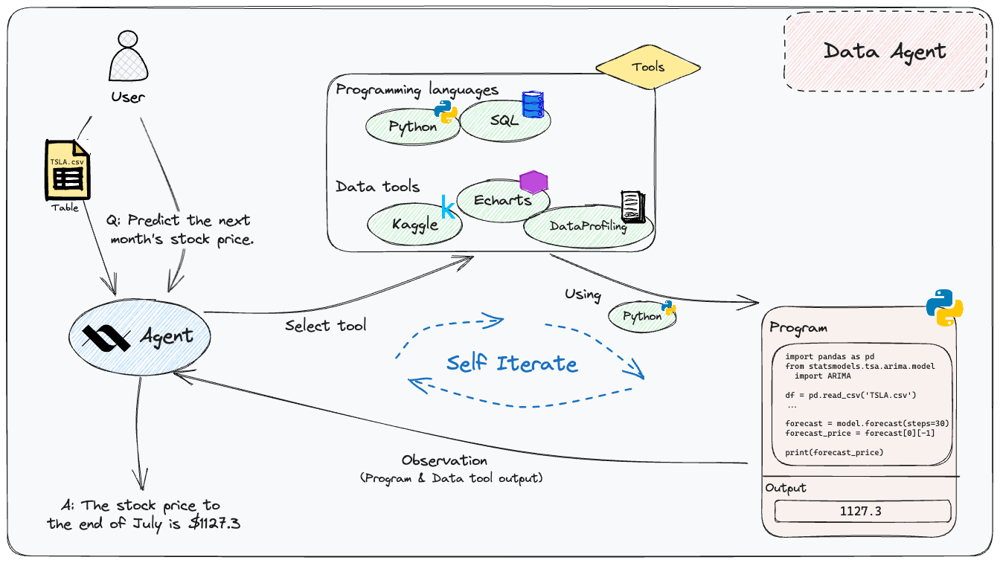
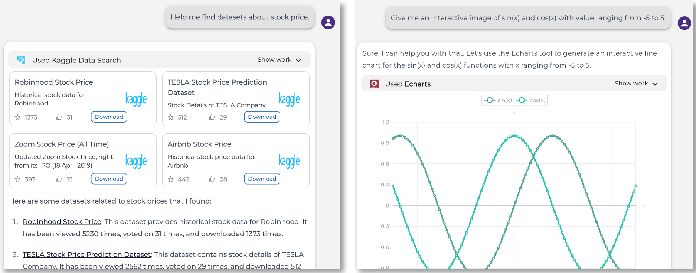
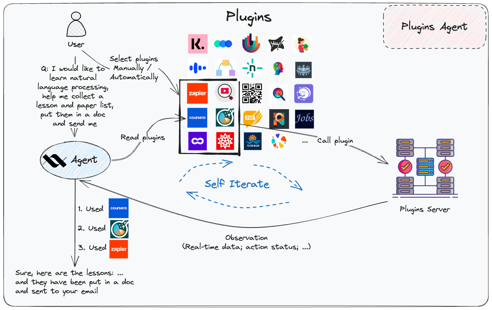
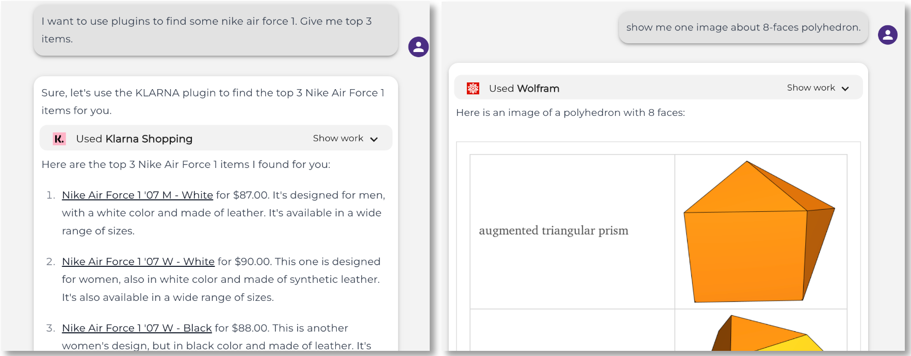
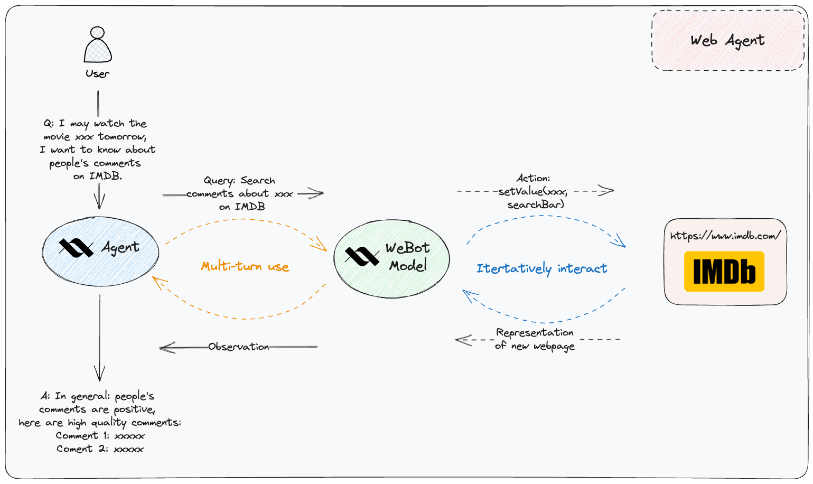
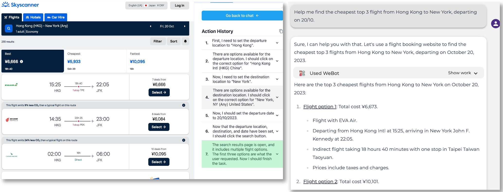
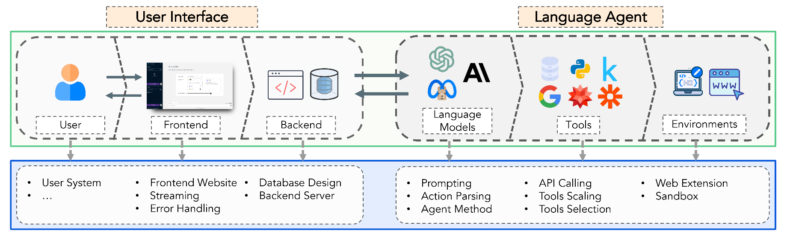

# [OpenAgents: An Open Platform for Language Agents in the Wild](https://arxiv.org/abs/2310.10634)

 <a href="https://arxiv.org/abs/2310.10634" target="_blank">
    
 </a>
 <a href="https://chat.xlang.ai" target="_blank">
    
 </a>
 <a href="https://xlang.ai" target="_blank">
    
 </a>
 <a href="https://docs.xlang.ai" target="_blank">
    
 </a>
 <a href="https://opensource.org/license/apache-2-0" target="_blank">
      
   </a>
   <a href="https://github.com/xlang-ai/OpenAgents" target="_blank">
      
   </a>
   <a href="https://github.com/xlang-ai/OpenAgents/issues" target="_blank">
      
   </a>
   <a href="https://twitter.com/XLangNLP" target="_blank">
      
   </a>
   <a href="https://join.slack.com/t/xlanggroup/shared_invite/zt-20zb8hxas-eKSGJrbzHiPmrADCDX3_rQ" target="_blank">
      
   </a>
   <a href="https://discord.gg/4Gnw7eTEZR" target="_blank">
      
   </a>
<div align="center">
    
</div>

<p align="center">
    <a>English</a> •
    <a href="README_ZH.md">中文</a> •
    <a href="README_JA.md">日本語</a> •
    <a href="README_KO.md">한국어</a>
</p>

Current language agent frameworks aim to facilitate the construction of proof-of-concept language agents while neglecting the non-expert user access to agents and paying little attention to application-level designs.
We built OpenAgents, an open platform for using and hosting language agents in the wild of everyday life.

We have now implemented three agents in OpenAgents, and we host them on [demo](https://chat.xlang.ai) for free use!
1. Data Agent for data analysis with Python/SQL and data tools; 
2. Plugins Agent with 200+ daily tools; 
3. Web Agent for autonomous web browsing.

OpenAgents can analyze data, call plugins, control your browser as ChatGPT Plus, but with OPEN Code for
1. Easy deployment
2. Full stack
3. Chat Web UI
4. Agent methods
5. …
   
OpenAgents enables general users to interact with agent functionalities through a web UI optimized for swift responses and common failures, while offering developers and researchers a seamless deployment experience on local setups, providing a foundation for crafting innovative language agents and facilitating real-world evaluations.
We elucidate both the challenges and promising opportunities, aspiring to set a foundation for future research and development of real-world language agents.

We welcome contributions from everyone. Before you start, please take a moment to read our [CONTRIBUTING.md](./CONTRIBUTING.md) guidelines for issues and PRs. This will help ensure that your contribution process is smooth and consistent with the project’s standards.

## 🔫 Trouble Shooting
Join our Discord for help if you encounter any issues with our [online demo](https://chat.xlang.ai) or local deployment. Alternatively, create an [issue](https://github.com/xlang-ai/OpenAgents/issues) if you have trouble with features or code.

## 🔥 News

- **[2023, Oct 26]** We've reached 3,000 users! 🚀 Heartfelt thanks to all our users and contributors! 🙏 Please bear with us as we navigate through unexpectedly high traffic on our servers. We appreciate your patience and ready to assist as soon as possible!
- **[2023, Oct 18]** Try out [our Lemur](https://github.com/OpenLemur/Lemur), the SOTA and open-sourced foundation models for language agents, matching ChatGPT on 15 agent tasks!
- **[2023, Oct 17]** Check out the OpenAgents paper [here](https://arxiv.org/abs/2310.10634)!
- **[2023, Oct 13]** We've released OpenAgents platform code for all three agents, server backend and frontend! Feel free to setup your localhost one, and play with OpenAgents!
- **[2023, Aug 17]** Our platform has officially reached 500 users! 🚀
- **[2023, Aug 8]** We've released [OpenAgents demos](https://chat.xlang.ai), including Data, Plugins, and Web agents! Check [tutorials](https://docs.xlang.ai/category/user-manual) and [use cases](https://docs.xlang.ai/category/use-cases)!


## 🥑 OpenAgents

We built three real-world agents with chat-based web UI as demonstration(check [OpenAgents demos](https://chat.xlang.ai)). Here is a brief overview of our OpenAgents platform. You can find more details about concepts & designs in our [documentation](https://docs.xlang.ai).

### Data Agent

[Data Agent](https://github.com/xlang-ai/OpenAgents/tree/main/real_agents/data_agent) is a comprehensive toolkit designed for efficient data operations. It provides capabilities to:

- 🔍 **Search**: Quickly locate the data you need.
- 🛠️ **Handle**: Streamline data acquisition and processing.
- 🔄 **Manipulate**: Modify data to suit specific requirements.
- 📊 **Visualize**: Represent data in a clear and insightful manner.

With its proficiency in writing and executing code, Data Agent simplifies a wide range of data-centric tasks. Discover its potential through various [use cases](https://docs.xlang.ai/use-cases/data-agent).

<div align="center">
    
</div>

<details>
  <summary>Click to see more use case screenshots</summary>
<div align="center">
    
</div>

</details>

### Plugins Agent

[Plugins Agent](https://github.com/xlang-ai/OpenAgents/tree/main/real_agents/plugins_agent) seamlessly integrates with over 200 third-party plugins, each handpicked to enrich various facets of your daily life. With these plugins at its disposal, the agent empowers you to tackle a wide range of tasks and activities more efficiently.

🔌 **Sample Plugins Include**:

- 🛍️ **Shopping**: Klarna Shopping
- ☁️ **Weather**: XWeather
- 🔬 **Scientific Exploration**: Wolfram Alpha

#### Combined Plugin Usage

Harness the power of synergy! Plugins Agent supports the concurrent use of multiple plugins. Planning a trip? Seamlessly integrate functionalities from Klook, Currency converter, and WeatherViz.

#### Auto Plugin Selection

Simplify your choices with our **Auto Plugin Selection** feature. Let the agent intuitively search and suggest the best plugins tailored to your needs.

Dive into more [use cases](https://docs.xlang.ai/use-cases/plugins-agent) to see Plugins Agent in action.

<div align="center">
  
</div>

<details>
  <summary>Click to see more use case screenshots</summary>
<div align="center">
    
</div>

</details>

### Web Agent

[Web Agent](https://github.com/xlang-ai/OpenAgents/tree/main/real_agents/web_agent) harnesses the power of a Chrome extension to navigate and explore websites automatically. This agent streamlines the web browsing experience, making it easier to find relevant information, access desired resources, and so on.

**Examples of What Web Agent Can Do**:

- 📍 **Google Maps Navigation**: Planning a journey? Simply relay your starting point and destination to Web Agent. It will navigate Google Maps for you and present the best routes.
- 🐦 **Twitter Postings**: Engage in a conversation with Web Agent and wish to share something on Twitter? Mention the content, and Web Agent will handle your tweet effortlessly.
- 📝 **Google Form Assistance**: Need to sign up for an event or activity? Share the Google Form link and the required details. Web Agent will populate the form for you.

Witness the full potential of Web Agent in these [use cases](https://docs.xlang.ai/use-cases/web-agent).

<div align="center">
  
</div>

<details>
  <summary>Click to see more use case screenshots</summary>
<div align="center">
    
</div>

</details>


## 💻 Localhost Deployment

We've released the OpenAgents platform code. Feel free to deploy on your own localhost!

Here is a brief system design of OpenAgents:
<div align="center">
    
</div>

### From Source Code

Please check the following folders and README files to set up & localhost:

1. [**Backend**](backend/README.md): the flask backend to host our three agents.
2. [**Frontend**](frontend/README.md): the frontend UI and WeBot Chrome extension.

p.s.: We have renamed some arguments in code for better readability. If you have pulled the code before 10/26/2023, just a reminder that if you want to you pull the latest code, previous local chat history will be lost because of different key names.

### Docker

Please follow the following steps to use the docker-compose to deploy the OpenAgents platform.

*Note:* the docker is under development, so there may be functions not working properly as expected and slower response. Please feel free to open an issue if you have any questions. If you want a more robust version, currently we recommend you to deploy from source code.

1. If you want to use kaggle's dataset, you must modify the information in the [Dockerfile](Dockerfile#L12) to your correct information.
```
ENV KAGGLE_USER="" \
    KAGGLE_KEY="" 
```
2. If you are not running locally, you need to modify the accessible IP to the backend service in [frontend/Dockerfile](frontend/Dockerfile#L15)
```
ENV NEXT_PUBLIC_BACKEND_ENDPOINT http://x.x.x.x:8000
``` 
3. Run the `docker compose build` command in the project root directory.
4. If you use openai unofficial services, such as [FastChat](https://github.com/lm-sys/FastChat), you need to modify `OPENAI_API_BASE` in [docker-compose.yml](docker-compose.yml#L36);otherwise you only to put your `OPENAI_API_KEY`  in [docker-compose.yml](docker-compose.yml#L36)
5. After completing the above steps, you can run `docker compose up -d` to start all services.

**Notice**:
1. If you want to use GPU, you need install [Nvidia Container Toolkit](https://docs.nvidia.com/datacenter/cloud-native/container-toolkit/latest/install-guide.html),and uncomment the the [docker-compose.yml](docker-compose.yml#L56-L62) Lines 56-62.
2. Use Auto Plugin will download the weight file from huggingface. In some areas, connection timeout may occur. Please solve the network problem by yourself.


## 📜 Tutorial on Extending OpenAgents
### Code Structure
Before we dive into how to extend OpenAgents, let's first take a glance at the code structure for better understanding. 
The code structure of OpenAgents is shown below:
```bash
├── backend  # backend code
│   ├── README.md  # backend README for setup
│   ├── api  # RESTful APIs, to be called by the frontend
│   ├── app.py  # main flask app
│   ├── display_streaming.py  # rendering the streaming response
│   ├── kernel_publisher.py  # queue for code execution
│   ├── main.py  # main entry for the backend
│   ├── memory.py  # memory(storage) for the backend
│   ├── schemas.py  # constant definitions
│   ├── setup_script.sh  # one-click setup script for the backend
│   ├── static  # static files, e.g., cache and figs
│   └── utils  # utilities
├── frontend  # frontend code
│   ├── README.md  # frontend README for setup
│   ├── components  # React components
│   ├── hooks  # custom React hooks
│   ├── icons  # icon assets
│   ├── next-env.d.ts  # TypeScript declarations for Next.js environment variables
│   ├── next-i18next.config.js  # configuration settings for internationalization
│   ├── next.config.js  # configuration settings for Next.js
│   ├── package-lock.json  # generated by npm that describes the exact dependency tree
│   ├── package.json  # manifest file that describes the dependencies
│   ├── pages  # Next.js pages
│   ├── postcss.config.js  # configuration settings for PostCSS
│   ├── prettier.config.js  # configuration settings for Prettier
│   ├── public  # static assets
│   ├── styles  # global styles
│   ├── tailwind.config.js  # configuration settings for Tailwind CSS
│   ├── tsconfig.json  # configuration settings for TypeScript
│   ├── types  # type declarations
│   ├── utils  # utilities or helper functions
│   ├── vitest.config.ts  # configuration settings for ViTest
│   └── webot_extension.zip  # Chrome extension for Web Agent
└── real_agents  # language agents
    ├── adapters  # shared components for the three agents to adapt to the backend
    ├── data_agent  # data agent implementation
    ├── plugins_agent  # plugins agent implementation
    └── web_agent  # web agent implementation
```
As shown, `backend/` and `frontend/` are self-contained and directly deployable (see [here](#localhost-deployment)).
It does not mean they cannot be modified.
Instead, you can just follow the conventional *client-server* architecture to extend the backend and frontend as you wish.
For `real_agents/`, we design it to be "one agent, one folder", so that it is easy to extend a new agent. 
It is worth noting that we name it "real agents" because not only the conceptual language agent part is included, but also the gaps between the language agent and the backend are filled here.
For example, `adapters/` contains the shared adapter components like stream parsing, data model, memory, callbacks, etc.
We refer interested readers to our [paper](https://arxiv.org/abs/2310.10634) for concepts and implementation designs.
And we thank [LangChain](https://github.com/langchain-ai/langchain) as we base on their code to build real agents.

### Extend A New Agent
If you want to build a new agent beyond the three agents we provide, you can follow the steps below:
- Refer to the `real_agents/` folder to see how previous agents are implemented, and create a new folder for your agent.
- Implement the agent logic in the new folder. Use the components under `adapters/` folder when needed.
- Add a `chat_<new_agent>.py` file under `backend/api/` folder to define the chat API for the new agent, which will be called by the frontend.
- Register new constants in `backend/schemas.py` if needed.
- Add a new `OpenAgentID` in `frontend/types/agent.ts` and the corresponding API in `frontend/utils/app/api.ts` and `frontend/utils/app/const.ts`.
- Implement the agent UI in `frontend/components/Chat/Chat.tsx` and `frontend/components/Chat/ChatMessage.tsx` when needed.
- Run localhost script and test your new agent.

Note, if new data types, i.e., beyond text, image, table, and json, you may need to implement its parsing logic in `backend/display_streaming.py` and add new data models.

### Extend A New LLM
Extending a new LLM as the agent backbone is simpler if the LLM is already hosted and can be called via API.
Just register your new model in `backend/api/language_model.py`. Just refer to lemur-chat as a template.

If the LLM is not hosted yet, we have a tutorial on how to deploy a new LLM and expose it as an API [here]() (LLM hosting to todo).

### Extend A New Tool
If you want to extend a new tool in Plugins Agent, you can follow the steps below:
- Refer to the already built plugins in `real_agents/plugins_agent/plugins/`, and create a new folder for your tool.
- Implement the tool logic in the new folder. Note that `ai-plugin.json` and `openapi.yaml` are essential for the tool to be recognized(which can be generated by LLM following the others rather than manually written). And the `paths/` are for the actual tool API call.
- Register the new tool name in `real_agents/plugins_agent/plugins/plugin_names.py`.


## 👏 Contributing

Thanks to open-sourced communities’ efforts, such as [LangChain](https://github.com/langchain-ai/langchain), [ChatBot UI](https://github.com/mckaywrigley/chatbot-ui), [Taxy.ai browser extension](https://github.com/TaxyAI/browser-extension) and others. We are able to build our interface prototype much more conveniently and efficiently.

We welcome contributions and suggestions, together we move further to make it better! Following the steps will be well-received:

- **Step1:** Post an [issue](https://github.com/xlang-ai/OpenAgents/issues) if you want to add any additional features, enhancements, or encounter any problems during your experience. We would appreciate it if you follow the [issue template](https://github.com/xlang-ai/OpenAgents/blob/main/CONTRIBUTING.md). The issues will be discussed and assigned there.
- **Step2:** Whenever an issue is assigned, you can contribute by creating a [Pull Request](https://github.com/xlang-ai/OpenAgents/pulls) by following the [PR template](https://github.com/xlang-ai/OpenAgents/blob/main/CONTRIBUTING.md). You can also claim for any open issues. Together we can make OpenAgents better!
- **Step3:** PR will be merged or iterated after review and discussion. Thanks for your contribution!

Before you start, we highly recommend taking a moment to check [here](https://github.com/xlang-ai/OpenAgents/blob/main/CONTRIBUTING.md) before contribution.


## 📖 Documentation

Please check [here](https://docs.xlang.ai) for full documentation, which will be updated to stay on pace with the demo changes and the code release.


## 🧙‍Participants

### Tech Lead

<a href="https://github.com/Impavidity"></a>

### Co-Lead Contributors

<a href="https://github.com/BlankCheng"></a>
<a href="https://github.com/koalazf99"></a>
<a href="https://github.com/Timothyxxx"></a>

### Key Contributors

<a href="https://github.com/taogoddd"></a>
<a href="https://github.com/WhiteWolf82"></a>
<a href="https://github.com/ztjhz"></a>

### Valuable Contributors

<a href="https://github.com/BillStark001"></a>
<a href="https://github.com/SivilTaram"></a>
<a href="https://github.com/che330"></a>
<a href="https://github.com/leo-liuzy"></a>
<a href="https://github.com/ranpox"></a>
<a href="https://github.com/hongjin-su"></a>
<a href="https://github.com/QIN2DIM"></a>
<a href="https://github.com/xJQx"></a>
<a href="https://github.com/thomasshin"></a>

### Acknowledgments (beyond code)

Heartfelt appreciation to [Ziyi Huang](https://www.joanna-ziyi-huang.com/), [Roxy Rong](https://www.linkedin.com/in/roxyrong/), [Haotian Li](https://haotian-li.com/), [Xingbo Wang](https://andy-xingbowang.com/), [Jansen Wong](https://www.linkedin.com/in/jansenwong/), and [Chen Henry Wu](https://chenwu.io/) for their valuable contributions to the OpenAgents. Their expertise and insights were instrumental in bringing this project to fruition!

### Open Source Contributors

Thanks to all the contributors!

<a href="https://github.com/xlang-ai/OpenAgents/graphs/contributors">
  
</a>

## Citation
If you find our work helpful, please cite us:
```
@misc{OpenAgents,
      title={OpenAgents: An Open Platform for Language Agents in the Wild}, 
      author={Tianbao Xie and Fan Zhou and Zhoujun Cheng and Peng Shi and Luoxuan Weng and Yitao Liu and Toh Jing Hua and Junning Zhao and Qian Liu and Che Liu and Leo Z. Liu and Yiheng Xu and Hongjin Su and Dongchan Shin and Caiming Xiong and Tao Yu},
      year={2023},
      eprint={2310.10634},
      archivePrefix={arXiv},
      primaryClass={cs.CL}
}
```

## Acknowledgments

We would like to thank Google Research, Amazon AWS, and Salesforce Research for their research gift funds to this open-source effort!

<div align="center">


<a href="https://www.salesforceairesearch.com/">
    
</a>


<a href="https://research.google/">
    
</a>


<a href="https://www.amazon.science/" style="display: inline-block; margin-bottom: -100px;">
    
</a>


</div>

## ⭐️ Star History

[](https://github.com/xlang-ai/OpenAgents/stargazers)

<h3 align="center">
A ⭐️ to <b>OpenAgents</b> is to make it shine brighter and benefit more people.
</h3>

