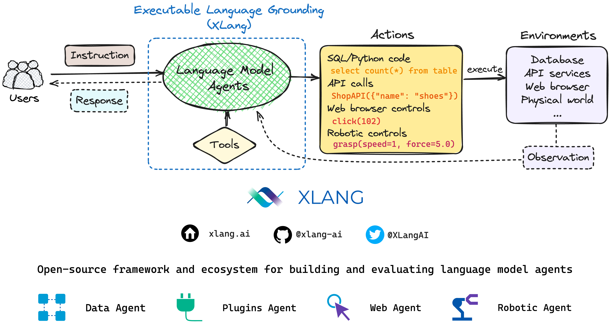

# XLang: An Open-Source Framework for Building Language Model Agents via Executable Language Grounding

 
 
 
 
 
   
   
   
   

    

## 🔥 News:
- **[2023, Aug 17]** Our demo has officially reached 500 users! 🚀
- **[2023, Aug 8]** We've released [XLang Agent demos](https://chat.xlang.ai), including Data, Plugins, and Web agents! Check [tutorials](https://docs.xlang.ai/category/user-manual) and [use cases](https://docs.xlang.ai/category/use-cases)!

## 💻 Open-sourcing:

We are pushing forward to open-source our framework, models, demos, code, benchmarks, and beyond. Please stay tuned! 🚀🚀

## 🥑 XLang Agents:

We built three real-world agents with chat-based web UI (check [XLang Agent demos](https://chat.xlang.ai)). Here is a brief overview of our XLang Agents framework. You can find more details about concepts & designs in our [documentation](https://docs.xlang.ai). 
### Data Agent
Data Agent is equipped with data-related tools, allowing it to search, handle, manipulate, and visualize data efficiently. It is proficient in writing and executing code, enabling various data-related tasks.

    

### Plugins Agent
Plugins Agent boasts integration with over 200 plugins from third-party sources. These plugins are carefully selected to cater to various aspects of your daily life scenarios. By leveraging these plugins, the agent can assist you with a wide range of tasks and activities.

  

### Web Agent
Web Agent harnesses the power of a Chrome extension to navigate and explore websites automatically. This agent streamlines the web browsing experience, making it easier to find relevant information, access desired resources, and so on.

  

## 📖 Documentation:

Please check [here](https://docs.xlang.ai) for full documentation, which will be updated to stay in pace with the demo changes and the code release.

## 👏 Contributing:
Thanks to open-sourced communities’ efforts, such as [LangChain](https://github.com/langchain-ai/langchain), [ChatBot UI](https://github.com/mckaywrigley/chatbot-ui), [Taxy.ai browser extension](https://github.com/TaxyAI/browser-extension) and others. We are able to build our interface prototype much more conveniently and efficiently.

We welcome contributions and suggestions, together we move further to make it better!

- 🐛 Post an [issue](https://github.com/xlang-ai/xlang/issues) if you encounter any problems during your experience, or if you want to add any additional features.
- 🕹 Directly contribute to our repo by creating a [Pull Request](https://github.com/xlang-ai/xlang/pulls). Together we can make XLang better!
- ⭐ Give us a star, follow us on [Twitter](https://twitter.com/XLangAI), share your own examples, and share with your friends!

## 🧙‍Participants
### Tech Lead:

### Co-Lead Contributors:
 

### Key Contributors:

### Valuable Contributors:

 
 
 
 

 
 

### Acknowledgements (beyond code):
Heartfelt appreciation to [Ziyi Huang](https://www.joanna-ziyi-huang.com/), [Roxy Rong](https://www.linkedin.com/in/roxyrong/), [Jansen Wong](https://www.linkedin.com/in/jansenwong/), and [Chen Wu](https://chenwu.io/) for their valuable contributions to the XLang Agents demo. Their expertise and insights were instrumental in bringing this project to fruition!
