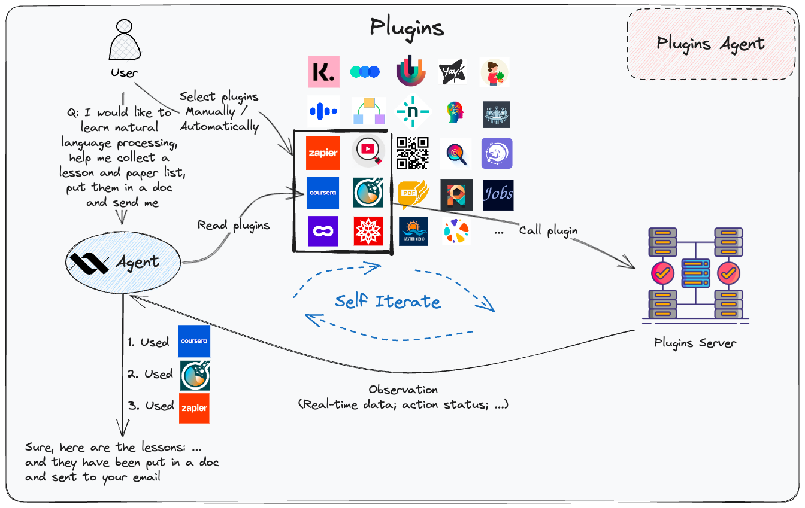

# Plugins Agent

  

[Plugins Agent](https://github.com/xlang-ai/xlang_agents/tree/code_clean/real_agents/plugins_agent) seamlessly integrates with over 200 third-party plugins, each handpicked to enrich various facets of your daily life. With these plugins at its disposal, the agent empowers you to tackle a wide range of tasks and activities more efficiently.

🔌 **Sample Plugins Include**:

- 🛍️ **Shopping**: Klarna Shopping
- ☁️ **Weather**: XWeather
- 🔬 **Scientific Exploration**: Wolfram Alpha

#### Combined Plugin Usage

Harness the power of synergy! Plugins Agent supports the concurrent use of multiple plugins. Planning a trip? Seamlessly integrate functionalities from Klook, Currency converter, and WeatherViz.

#### Auto Plugin Selection

Simplify your choices with our **Auto Plugin Selection** feature. Let the agent intuitively search and suggest the best plugins tailored to your needs.

Dive into more [use cases](https://docs.xlang.ai/use-cases/plugins-agent) to see Plugins Agent in action.
